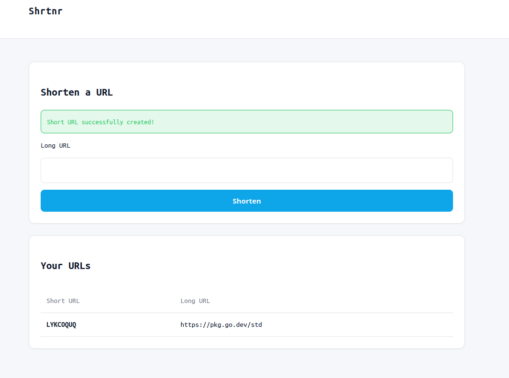
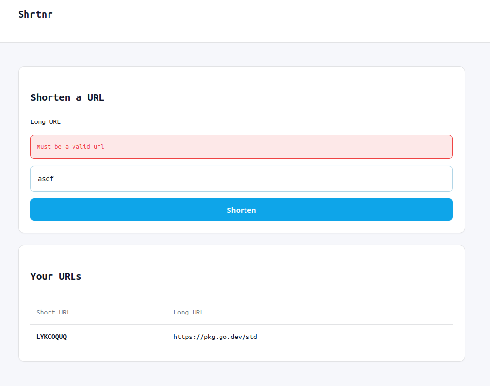

# Shrtnr

A URL **sh**o**rt**e**n**e**r** web application written in Go.

## Usage

```bash
make run/web
```

## MVP

- [x] Form to accept long URLs and return a shortened URL
    - [x] Only allow valid URLs
    - [ ] Allow users to provide a custom alias for the short URL
- [x] Redirect from a shortened URL to the original URL
- [ ] Persist URL mappings

## Extra

- [ ] User accounts
    - [ ] When signed in, users can have a per-user list of shortened URLs
    - [ ] Allow users to add, edit, delete, and create aliases for short URLs

## Tech Stack

- Backend:
    - Server: [go](https://go.dev/)
    - Database: [postgres](https://www.postgresql.org/)
    - Migrations: [migrate](https://github.com/golang-migrate/migrate)
    - SQL Compiler: [sqlc](https://github.com/sqlc-dev/sqlc)

My focus is on the backend, so I aim to keep the frontend as simple and lightweight as
possible.

- Frontend:
    - Go templates (html/template)
    - HTML / CSS / JavaScript

## Demo

### Create a short URL



### Validation error



### Redirect behavior

Shortened URLs use the `/r` route for redirection.
